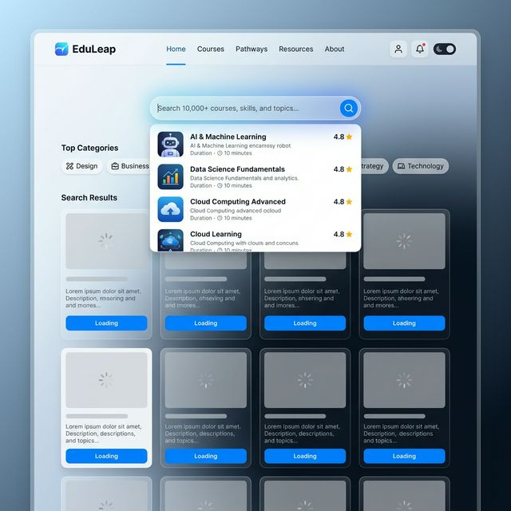

# 🚀 Course Explorer: Advanced Search & Suggestion System

A sophisticated Fullstack search platform for educational courses, built with **ASP.NET Core** and **Next.js**. This project implements high-performance search functionalities, dynamic suggestions, and a premium modern UI.



---

## ✨ Key Features

The platform focuses on providing an **exceptional search experience** with the following features:

### 🔍 Advanced Search Capabilities
- **Keywords Search**: Intelligent keyword-based course discovery.
- **Dynamic Suggestions**: 
  - Suggests related keywords as you type.
  - Recommends specific courses/items directly within the suggestion dropdown.
- **Category Filtering**: Seamlessly narrow down results by course categories.
- **Debounced Input**: Optimized API calls with smart debounce logic to enhance performance.

### 🌓 Premium User Experience
- **Search History**: Persistent local/backend logs (via LocalStorage or Database) for quick access to previous searches.
- **Micro-interactions**: 
  - **Grey Overlay**: Dynamic background darkening when the search bar is active to focus user attention.
  - **Skeleton Loading**: Smooth transitions with skeleton loaders during data fetching.
  - **Hot Keywords**: Trending searches displayed natively to guide user discovery.

### 🏗️ Flexible Architecture
- **Dual-mode Search Logs**:
  - Frontend-only: Efficient state management using `localStorage`.
  - Backend-driven: Robust historical data persistence in MySQL.

---

## 🛠️ Technology Stack

| Layer        | Technology                                                                                                       |
|--------------|------------------------------------------------------------------------------------------------------------------|
| **Frontend** | [](https://nextjs.org/) [](https://tailwindcss.com/) |
| **Backend**  | [](https://dotnet.microsoft.com/en-us/apps/aspnet) |
| **Database** | [](https://www.mysql.com/) |
| **UI/UX**    | **Antigravity Custom UI**, **Lucide Icons**, **CSS Glassmorphism**                                             |

---

## 📂 Project Structure

```bash
search-advanced-fullstack/
├── client/           # Next.js Frontend Application
│   ├── src/app       # App Router & UI Components
│   └── public        # Static Assets
├── server/           # ASP.NET Core Web API
│   ├── Program.cs    # Application Entry & Controllers
│   └── appsettings.json
└── SearchSolution.sln # VS Solution for Backend
```

---

## 🚀 Getting Started

### 1. Backend Setup (ASP.NET)
1. Navigate to the `server/` directory.
2. Ensure you have the .NET SDK installed.
3. Configure your MySQL connection string in `appsettings.json`.
4. Run the project:
   ```bash
   dotnet watch run
   ```

### 2. Frontend Setup (Next.js)
1. Navigate to the `client/` directory.
2. Install dependencies:
   ```bash
   npm install
   ```
3. Run the development server:
   ```bash
   npm run dev
   ```

---

## 🎨 UI & Design Principles

The project leverages modern design trends:
- **Glassmorphism**: Soft blurred backgrounds for suggestions.
- **Visual Feedback**: Real-time Skeleton loaders prevent "janky" layout shifts.
- **Accessibility**: High-contrast texts and semantic HTML for a universal experience.

---

## 📝 Roadmap & Requirements (Based on `note.txt`)
- [x] Keyword Search Implementation
- [x] Suggestion UI with Overlay
- [x] Skeleton Effects
- [ ] Backend Search Log Integration (Ongoing)
- [ ] Category Filter Refinement

Developed with ❤️ and **Antigravity** toolset.
